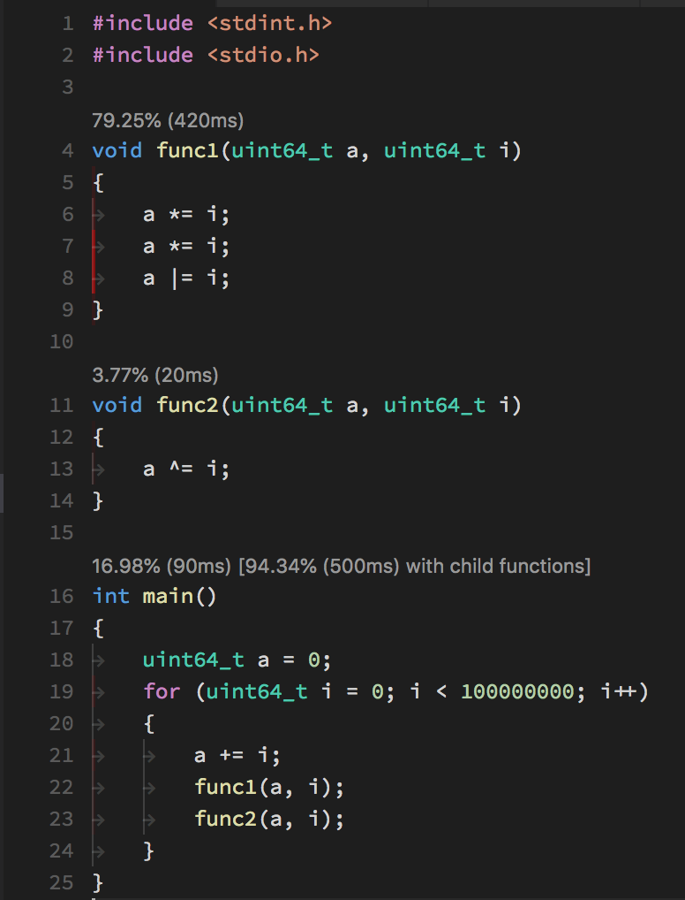

# c-cpp-perf-tools

This extension brings `gperftools` output inline into the VS Code editor, providing 
both a line by line heatmap as well as per-function runtime statistics.

## Features

Each function is annotated with both the percent and total runtime was spent in that function. Additionally, functions which call other functions also have statistics for
the total time spent in that function and functions called from that function.




## Requirements

This is a bit of a pain to install...

macOS:
 - `gperftools`: a standard `brew install gperftools` should be fine.
 - `pprof`: you *must* use the go version, found at https://github.com/google/pprof. The standard installation will not work.
 - `llvm`: you must augment the standard llvm with an additional `llvm-symbolizer`. Do do this:
    - `brew install llvm`
    - `ln -s /usr/local/opt/llvm/bin/llvm-symbolizer /usr/local/bin/llvm-symbolizer`
 - `ctags` this comes by default with macOS, but make sure you have it anyways.

Linux:
- this should work on linux, but I haven't personally tried.

## Building for Profiling

You must pass the `-lprofiler`, `-g`, and `-fno-pie` flags when compiling, and set the `CPUPROFILE` environment variable to the output location of your `.perf` file when executing. 

An example Makefile:
```
thing: thing.c
	clang -g -fno-pie -lprofiler -o thing thing.c otherthing.c thirdthing.c

thing.perf: thing
	CPUPROFILE=thing.perf ./thing
```

You can add this as a VS Code build task with the following `tasks.json` file:
```
{
    "version": "2.0.0",
    "tasks": [
        {
            "label": "Profile",
            "type": "process",
            "args": [
                "thing.perf"
            ],
            "command": "make",
            "group": "build",
            "problemMatcher": [],
            "presentation": {
                "echo": true,
                "reveal": "silent",
                "focus": false,
                "panel": "shared",
                "showReuseMessage": false
            }
        }
    ]
}
```

This will allow you to rebuild and see results live with a simple `cmd+shift+b` from inside Code.

## Extension Settings

* `c-cpp-perf.pprofPath`: set this to the *go version* of `pprof`. The defualt is `$GOPATH/bin/pprof`, which should hopefully work for most cases.  
* `c-cpp-perf.ctagsPath`: set this to the path to your `ctags` installation. The default is `ctags`, which should be fine so long as `ctags` is on your path.
* `c-cpp-perf.perfReportPath`: this should probably be configured in your workspace settings, as it may be different from project to project.

## Known Issues

Does not redraw heatmap on new editor load.

(among many others...)

## Release Notes

### 0.0.1

Initial release. This has bugs.
